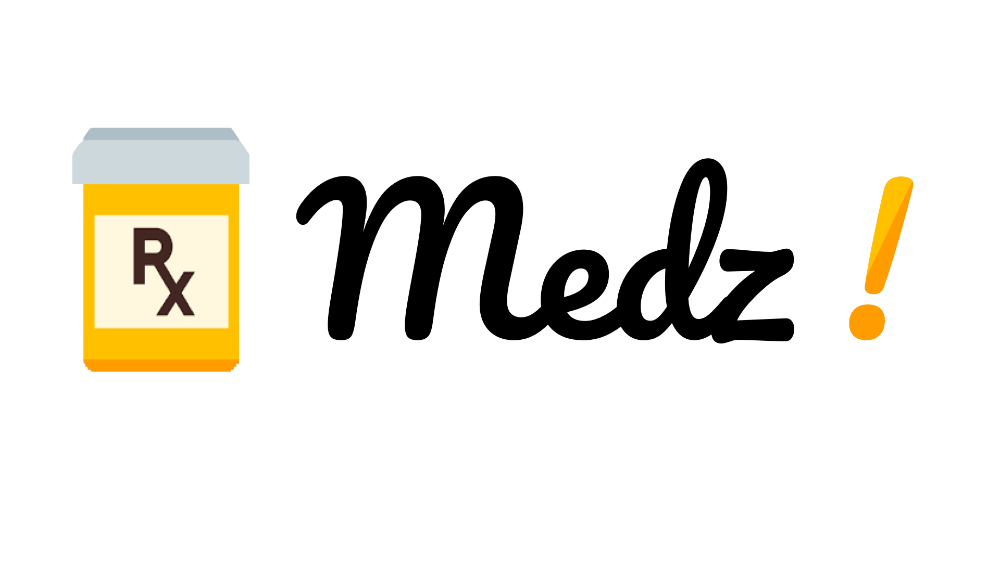

   

----------------------------------------------------------------

Medz! aims to solve a simple problem - helping people remember and manage their medications.

By leveraging OCR via Google Cloud Engine, Medz! is simple to use; simply scan your prescription or medicine bottle with your phone, and information is automatically recorded onto your phone. Medz! can then set reminders for taking and refilling your prescriptions and medicines. With large fonts and bright colors, Medz! is accessible to people of all ages as well.

Tech used:
- Google Cloud Enginer + Firebase for text extraction
- OpenFDA for drug lookup and information

Project Link: https://yhack2018.hackerearth.com/sprints/yhack-2018/dashboard/8c6728d/submission/
